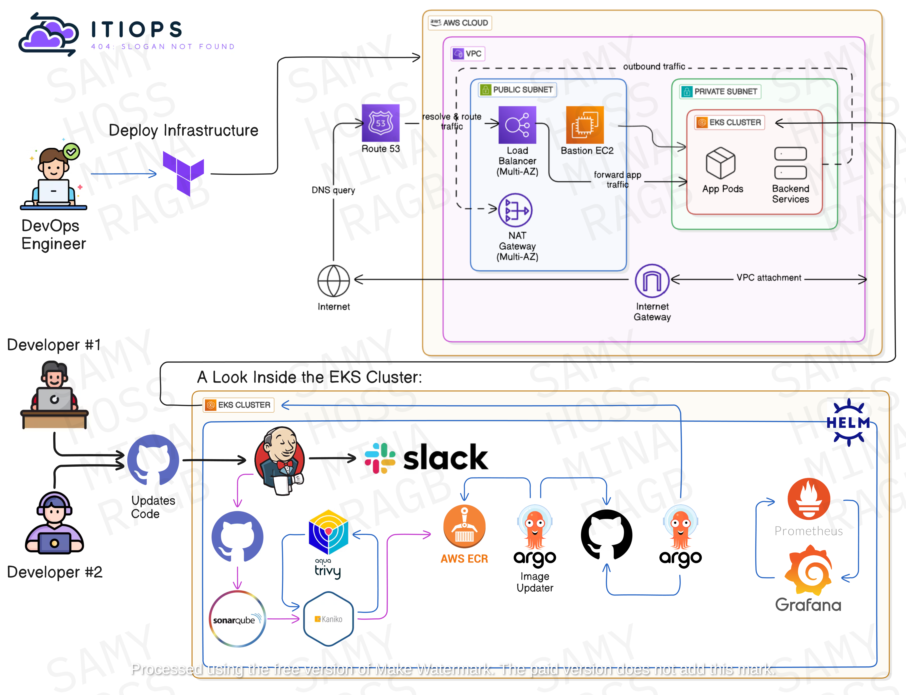

# ITIOPS: CLOUDSUITEx - INFRA DevOps Capstone

> **Team:** ITIOPS: CLOUDSUITEx - INFRA

---

## 📑 Table of Contents

1. [🚀 Project Overview](#project-overview)
2. [🏗 Architecture Diagram](#architecture-diagram)
3. [📋 Prerequisites](#prerequisites)
4. [1. Infrastructure Provisioning (Terraform)](#infrastructure-provisioning-terraform)
5. [2. CI Pipeline (Jenkins)](#ci-pipeline-jenkins)
6. [3. CD Pipeline (ArgoCD & Argo Image Updater)](#cd-pipeline-argocd--argo-image-updater)
7. [4. Secrets Management (External Secrets Operator)](#secrets-management-external-secrets-operator)
8. [5. Security Scanning (Trivy)](#security-scanning-trivy)
9. [6. Monitoring & Visualization (Prometheus & Grafana)](#monitoring--visualization-prometheus--grafana)
10. [7. Ingress & HTTPS (Route 53 & ACM)](#ingress--https-route 53--acm)
11. [8. Application Deployment](#application-deployment)
12. [📖 Detailed Setup & Execution](#detailed-setup--execution)
13. [📝 CI/CD Flow Summary](#cicd-flow-summary)

---

## 🚀 Project Overview

**Objective:** Provision and deploy a secure AWS infrastructure and CI/CD pipeline. Deploy a Node.js web application with MySQL and Redis, integrate security scanning, and set up monitoring and alerting.

**Key Features:**

* Infrastructure as Code with Terraform
* Continuous Integration with Jenkins
* GitOps-driven Continuous Delivery via ArgoCD & Argo Image Updater
* Secrets Management using External Secrets Operator & AWS Secrets Manager
* Security Scanning with Trivy
* Monitoring & Visualization using Prometheus & Grafana
* Ingress & HTTPS using Amazon Route 53 and AWS Certificate Manager (ACM)

---

## 🏗 Architecture Diagram



---

## 📋 Prerequisites

* AWS account with permissions for EKS, ACM, Route 53, Secrets Manager, ECR, IAM, and Networking
* Terraform v1.0+
* kubectl v1.23+
* Helm v3+
* Jenkins with Docker agent
* Git repository with application code

---

## 1. Infrastructure Provisioning (Terraform)

Terraform modules provision:

* **Networking:** VPC with 3 public and 3 private subnets across 3 AZs
* **Gateways & Routing:** Internet Gateway, NAT Gateways, Route Tables
* **EKS Cluster:** Managed control plane and node groups in private subnets
* **IAM:** Roles & policies for EKS, Jenkins, ArgoCD, and External Secrets Operator

```bash
cd terraform
terraform init
terraform apply -auto-approve
```

---

## 2. CI Pipeline (Jenkins)

Installed via Helm into EKS. Jenkins Pipelines:

1. **Clone** Node.js app repository
2. **Build** Docker image
3. **Scan** image with Trivy
4. **Push** image to Amazon ECR
5. **Apply** Terraform changes

```groovy
tage 'Security Scan'
steps {
  sh 'trivy image --exit-code 1 --severity HIGH,CRITICAL $IMAGE_URL'
}
```

---

## 3. CD Pipeline (ArgoCD & Argo Image Updater)

* **ArgoCD** syncs Kubernetes manifests from Git.
* **Argo Image Updater** monitors ECR tags, updates manifests, triggers GitOps flow.

```bash
helm upgrade --install argocd argo/argo-cd --namespace argocd
helm upgrade --install image-updater argo/argo-image-updater --namespace argocd
```

---

## 4. Secrets Management (External Secrets Operator)

Integrates with AWS Secrets Manager to inject:

* Database credentials
* Redis credentials

```yaml
apiVersion: external-secrets.io/v1beta1
kind: ExternalSecret
metadata:
  name: db-credentials
spec:
  refreshInterval: 1h
  secretStoreRef:
    name: aws-secrets
  target:
    name: db-secret
  data:
    - secretKey: username
      remoteRef:
        key: myapp-db-creds
        property: username
```

---

## 5. Security Scanning (Trivy)

Automated container image vulnerability scanning in Jenkins:

* Scans for HIGH and CRITICAL vulnerabilities
* Fails the build on detections
* Generates HTML & JSON reports

```bash
trivy image --format template --template "@contrib/html.tpl" -o trivy-report.html $IMAGE_URL
```

---

## 6. Monitoring & Visualization (Prometheus & Grafana)

* **Prometheus:** Scrapes metrics from the Node.js app, Kubernetes, and system components
* **Grafana:** Dashboards for app performance, cluster health, and alerting

```bash
helm repo add prometheus-community https://prometheus-community.github.io/helm-charts
helm install prometheus prometheus-community/prometheus
helm install grafana grafana/grafana
```

Import custom dashboards under `./monitoring/dashboards` via Grafana UI.

---

## 7. Ingress & HTTPS (Route 53 & ACM)

* **Route 53:** DNS hosted zone for `example.com`
* **ACM:** Provision and validate public TLS certificate
* **ALB Ingress Controller:** Annotated to use ACM certificate

```yaml
apiVersion: networking.k8s.io/v1
kind: Ingress
metadata:
  name: myapp-ingress
  annotations:
  ........
  ........

```

---

## 8. Application Deployment

Deploys a Node.js web application with MySQL and Redis pods:


Environment variables and secrets are managed via External Secrets Operator.

---


## 📝 CI/CD Flow Summary

1. **Code Commit:** Push changes to Git (manifests & source)
2. **Jenkins:** Builds, scans, and pushes Docker image 
3. **ECR:** New image tag pushed
4. **Argo Image Updater:** Detects new tag, updates Git manifests
5. **ArgoCD:** Syncs updated manifests to EKS

---

*Developed with ❤️ by ITIOPS: CLOUDSUITEx - INFRA Team*

## ✨ Team 

<div align="center">

<table>
  <tr>
    <td align="center">
      <a href="https://github.com/hosseldin">
        <br />
        <sub><b>Hossam Mahmoud</b></sub>
      </a>
    </td>
    <td align="center">
      <a href="https://github.com/mina-safwat-1">
        <br />
        <sub><b>Mina Safwat</b></sub>
      </a>
    </td>
    <td align="center">
      <a href="https://github.com/M-Samii">
        <br />
        <sub><b>Mahmoud Samy</b></sub>
      </a>
    </td>
    <td align="center">
      <a href="https://github.com/Mohamed0Mourad">
        <br />
        <sub><b>Mohammed Mourad</b></sub>
      </a>
    </td>
  </tr>
</table>

</div>


<br>
