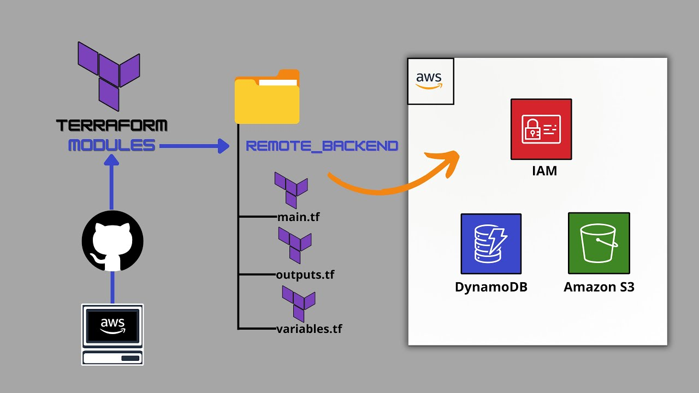

<h1 align="center">Terraform IaC on GCP Testing Environment</h1>

### This directory contains Terraform provisioning code used to deploy resources on Amazon Web Services (AWS). The purpose of this setup is to explore and test various AWS services that will be available for production.
<hr>




## ✨ Contributors

This project would not have been possible without the valuable contributions of these collaborators:

<table>
  <tr>
    <td align="center">
      <a href="https://github.com/hosseldin">
        <br />
        <sub><b>Hossam Mahmoud</b></sub>
      </a>
    </td>
    <td align="center">
      <a href="https://github.com/mina-safwat-1">
        <br />
        <sub><b>Mina Safwat</b></sub>
      </a>
    </td>
    <td align="center">
      <a href="https://github.com/M-Samii">
        <br />
        <sub><b>Mahmoud Samy</b></sub>
      </a>
    </td>
    <td align="center">
      <a href="https://github.com/Mohamed0Mourad">
        <br />
        <sub><b>Mohammed Mourad</b></sub>
      </a>
    </td>
  </tr>
</table>

<br>

## Brief 📃
Build a production-ready, secure DevOps pipeline on AWS, using GitOps practices to automate infrastructure provisioning, application deployment, and secrets management.

<br>

## Requirements to Run 📃
- Linux-based operating system
- AWS Account
- Terraform
- Jenkins

<br>

## Usage 🪧
## Prerequisites
### Install Google Cloud
#### For Debian Based 💻:
Visit [Google Cloud Platform Debian Installation](https://cloud.google.com/sdk/docs/install#deb) for more information.

Update your system and install some important packages
```bash
sudo apt-get install apt-transport-https ca-certificates gnupg curl
```

Import the Google Cloud public key and add the gcloud CLI distribution URI as a package source.
```bash
curl https://packages.cloud.google.com/apt/doc/apt-key.gpg | sudo gpg --dearmor -o /usr/share/keyrings/cloud.google.gpg
echo "deb [signed-by=/usr/share/keyrings/cloud.google.gpg] https://packages.cloud.google.com/apt cloud-sdk main" | sudo tee -a /etc/apt/sources.list.d/google-cloud-sdk.list
```

Update and install the gcloud CLI
```bash
sudo apt-get update && sudo apt-get install google-cloud-cli
```

Enable required APIs
```bash
gcloud services enable compute.googleapis.com
```

Create a Service Account for Terraform
```bash
gcloud iam service-accounts create terraform --display-name "Terraform Hosa account"
```

Then bind rules
```bash
gcloud projects add-iam-policy-binding summer-gadget-457014-u2 \
  --member="serviceAccount:terraform@summer-gadget-457014-u2.iam.gserviceaccount.com" \
  --role="roles/editor"
```

Create and download service account key
```bash
gcloud iam service-accounts keys create ~/gcp-terraform-key.json \
  --iam-account=terraform@summer-gadget-457014-u2.iam.gserviceaccount.com
```

Set environment variable for Terraform
```bash
export GOOGLE_APPLICATION_CREDENTIALS=~/gcp-terraform-key.json
```

<br>

## To Run the App 🏃🏻bind rules
You can run the application by running this command: **`./mainMenu.sh`**

<br>

## Directory Setup 🎚️
The script ensures that a directory named `DATABASES` is created in the main directory if it does not exist. This directory will contain all the databases created and their corresponding tables.

<br>

## License 🪪
This project is licensed under the GPL License.

<br>

## Acknowledgments 🏁
- [Zenity Documentation](https://help.gnome.org/users/zenity/stable/)
- Bash scripting community and resources
- Project Description inspired by Tohamey & Samy

<br>

## Future Enhancements 💭
- Add support for advanced SQL-like queries.
- Add security measures for database access.

---

Thank you for using our DBMS!  
Feel free to reach out if you encounter any issues or have suggestions.
- [Hossam Mahmoud](hossam.uddin1@gmail.com) ✉️
- [Abdelrahman Khaled](Abdelrahmankhalid27@gmail.com) ✉️
- [Zeyad Tarek](ziadtarekmohamed32@gmail.com) ✉️


=====================================
=====================================

Bash Shell Script Database Management System (DBMS):

The Project aim to develop DBMS, that will enable users to store and retrieve the data from main storage.

The Project Features:
The Application will be CLI Menu based app, that will provide to user this Menu items:
Main Menu:
- Create Database
- List Databases
- Connect To Databases
- Drop Database

Up on user Connect to Specific Database, there will be new Screen with this Menu:
- Create Table 
- List Tables
- Drop Table
- Insert into Table
- Select From Table
- Delete From Table
- Update Row

Hints:
- The Database will store as Directory on Current Script File
- Don't use Absolute Path in your scripts
- The Tables store in files, which can be CSV or JSON or XML File format
- You can divide the Table info to two tables: Meta-data and Raw Data in separate files or the same file
- When Create Table, The Meta Data of Table will be: Table Name, Number of Columns, Name Of Columns
- There is assumption that First Column is Primary Key, which used for Delete Rows.
- The Select of Rows displayed in screen/terminal in Accepted/Good Format
- Keep track of Data Types (Digits or Strings) of Column and Validated user input based on it

The Bonus:
- Make the App to accept SQL Code Instead of Above Menu Based
- Make GUI of Application 'Plus" the current CLI view
