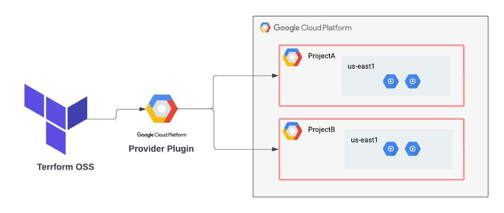

<h1 align="center">Terraform IaC on GCP Testing Environment</h1>

### This directory contains Terraform provisioning code used to deploy resources on Google Cloud Platform (GCP). The purpose of this setup is to explore and test various GCP services within a controlled, non-production environment.
<hr>




## ✨ Contributors

This project would not have been possible without the valuable contributions of these collaborators:

<table>
  <tr>
    <td align="center">
      <a href="https://github.com/hosseldin">
        <br />
        <sub><b>Hossam Mahmoud</b></sub>
      </a>
    </td>
    <td align="center">
      <a href="https://github.com/mina-safwat-1">
        <br />
        <sub><b>Mina Safwat</b></sub>
      </a>
    </td>
    <td align="center">
      <a href="https://github.com/M-Samii">
        <br />
        <sub><b>Mahmoud Samy</b></sub>
      </a>
    </td>
    <td align="center">
      <a href="https://github.com/Mohamed0Mourad">
        <br />
        <sub><b>Mohammed Mourad</b></sub>
      </a>
    </td>
  </tr>
</table>

<br>

## Brief 📃
This project implements a database system coded in Bash, powered by Zenity GUI.
The DBMS provides basic operations like creating, reading, updating, and deleting databases/tables. It is implemented in a very user-friendly way, achieving smooth and instant transitions between menu operations.

## Features 🌟
  - Create Database
  - View Databases
  - Drop Database
  - **Connect to Database**
    - ***Operations:***
      - Create Table
      - View Table
      - Drop Table
      - Insert Data into Table
      - Update Data into Table
      - Delete Data from Table
  - Error Handling
<br>

## Project Structure 🪜
The project is structured in the following manner:

- **Main Menu APIs**
  - `mainMenu.sh`
  - `createDataBase.sh`
  - `dropDataBase.sh`
  - `listDataBase.sh`
  - `connectDatabase.sh`
  - `connectMenu.sh`
- **Connect Database Menu APIs**
  - `createTable.sh`
  - `deleteFromTable.sh`
  - `dropTable.sh`
  - `insertTable.sh`
  - `listTable.sh`
  - `pickTable.sh`
  - `selectFromTable.sh`
  - `updateTable.sh`

<br>

## Requirements to Run 📃
- Bash / Zsh Shell
- Zenity (to enable the GUI interface)
- Linux-based operating system

<br>

## Usage 🪧
## Prerequisites
### Install Google Cloud
#### For Debian Based 💻:
Visit [Google Cloud Platform Debian Installation](https://cloud.google.com/sdk/docs/install#deb) for more information.

Update your system and install some important packages
```bash
sudo apt-get install apt-transport-https ca-certificates gnupg curl
```

Import the Google Cloud public key and add the gcloud CLI distribution URI as a package source.
```bash
curl https://packages.cloud.google.com/apt/doc/apt-key.gpg | sudo gpg --dearmor -o /usr/share/keyrings/cloud.google.gpg
echo "deb [signed-by=/usr/share/keyrings/cloud.google.gpg] https://packages.cloud.google.com/apt cloud-sdk main" | sudo tee -a /etc/apt/sources.list.d/google-cloud-sdk.list
```

Update and install the gcloud CLI
```bash
sudo apt-get update && sudo apt-get install google-cloud-cli
```

Enable required APIs
```bash
gcloud services enable compute.googleapis.com
```

Create a Service Account for Terraform
```bash
gcloud iam service-accounts create terraform --display-name "Terraform Hosa account"
```

Then bind rules
```bash
gcloud projects add-iam-policy-binding summer-gadget-457014-u2 \
  --member="serviceAccount:terraform@summer-gadget-457014-u2.iam.gserviceaccount.com" \
  --role="roles/editor"
```

Create and download service account key
```bash
gcloud iam service-accounts keys create ~/gcp-terraform-key.json \
  --iam-account=terraform@summer-gadget-457014-u2.iam.gserviceaccount.com
```

Set environment variable for Terraform
```bash
export GOOGLE_APPLICATION_CREDENTIALS=~/gcp-terraform-key.json
```

<br>

## To Run the App 🏃🏻bind rules
You can run the application by running this command: **`./mainMenu.sh`**

<br>

## Directory Setup 🎚️
The script ensures that a directory named `DATABASES` is created in the main directory if it does not exist. This directory will contain all the databases created and their corresponding tables.

<br>

## License 🪪
This project is licensed under the GPL License.

<br>

## Acknowledgments 🏁
- [Zenity Documentation](https://help.gnome.org/users/zenity/stable/)
- Bash scripting community and resources
- Project Description inspired by Tohamey & Samy

<br>

## Future Enhancements 💭
- Add support for advanced SQL-like queries.
- Add security measures for database access.

---

Thank you for using our DBMS!  
Feel free to reach out if you encounter any issues or have suggestions.
- [Hossam Mahmoud](hossam.uddin1@gmail.com) ✉️
- [Abdelrahman Khaled](Abdelrahmankhalid27@gmail.com) ✉️
- [Zeyad Tarek](ziadtarekmohamed32@gmail.com) ✉️


=====================================
=====================================

Bash Shell Script Database Management System (DBMS):

The Project aim to develop DBMS, that will enable users to store and retrieve the data from main storage.

The Project Features:
The Application will be CLI Menu based app, that will provide to user this Menu items:
Main Menu:
- Create Database
- List Databases
- Connect To Databases
- Drop Database

Up on user Connect to Specific Database, there will be new Screen with this Menu:
- Create Table 
- List Tables
- Drop Table
- Insert into Table
- Select From Table
- Delete From Table
- Update Row

Hints:
- The Database will store as Directory on Current Script File
- Don't use Absolute Path in your scripts
- The Tables store in files, which can be CSV or JSON or XML File format
- You can divide the Table info to two tables: Meta-data and Raw Data in separate files or the same file
- When Create Table, The Meta Data of Table will be: Table Name, Number of Columns, Name Of Columns
- There is assumption that First Column is Primary Key, which used for Delete Rows.
- The Select of Rows displayed in screen/terminal in Accepted/Good Format
- Keep track of Data Types (Digits or Strings) of Column and Validated user input based on it

The Bonus:
- Make the App to accept SQL Code Instead of Above Menu Based
- Make GUI of Application 'Plus" the current CLI view
